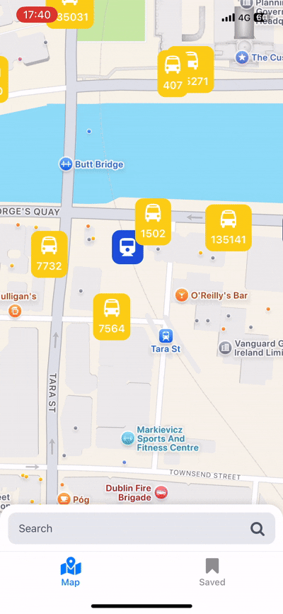
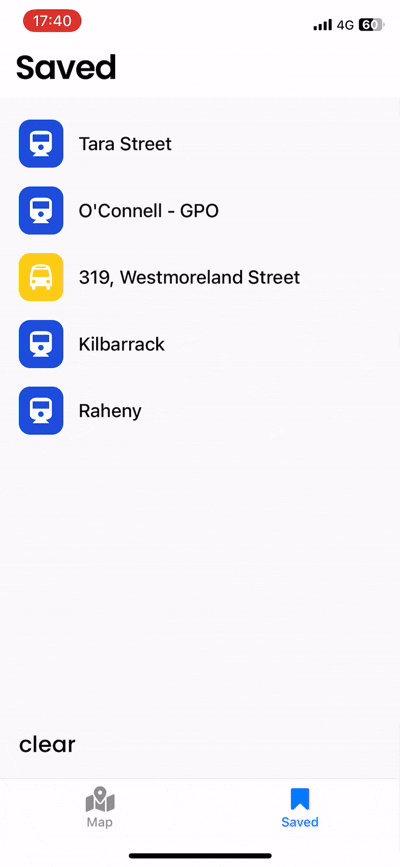

# TransportApp

A modern, user-friendly mobile app for exploring public transport options in Ireland, designed to offer a superior experience compared to the current official solutions. Built with React Native and powered by the transit.land API, TransportApp makes it easy to discover, search, and save public transit stops, with support for real-time departures and interactive map clustering. With minor adjustments, it can be adapted for any region supported by the transit.land API.

---

## Features

- **Interactive Map:** View all nearby public transport stops on a map, with clustering for performance and clarity (using `react-native-clusterer`).
- **Search:** Quickly find specific stops by name.
- **Realtime Departures:** Select any stop (via map or search) to view upcoming departures in real time.
- **Saved Stops:** Save your favourite stops for quick access in the Saved tab.
- **Customizable:** Easily adaptable for any region covered by the transit.land API.

---

## Demo


| Action                        | Demo GIF                                    |
|-------------------------------|---------------------------------------------|
| Clicking a stop on the map    |      |
| Searching for a stop          |            |
| Clicking a stop in Saved tab  |    |

---

## Installation

**Prerequisites:**
- Node.js (latest LTS recommended)
- [Expo CLI](https://docs.expo.dev/get-started/installation/)
- A transit.land API key

**Setup:**
1. Clone the repository:
   ```sh
   git clone https://github.com/NichitaCon/TransportApp.git
   cd TransportApp
   ```

2. Install dependencies:
   ```sh
   npm install
   ```

3. Create a `.env` file in the root directory with your transit.land API key:
   ```
   EXPO_PUBLIC_TRANSITLAND_KEY=your_api_key_here
   ```

4. **Run in development build (cannot use Expo Go):**
   ```sh
   npx expo run:android  # or npx expo run:ios
   ```

   > **Note:** The app CANNOT run in Expo Go!!!!, as it relies on custom native code (`react-native-clusterer`).

---

## Configuration

- **API Key:** Place your transit.land key in `.env` as shown above.
- **Region Support:** The app defaults to Ireland, but can be easily configured for any area supported by transit.land.

---

## Known Issues

- At close zoom levels, map markers may randomly disappear. Zooming out and back in will restore them. (This is a known issue with clustering and is being investigated.)

---

## Roadmap

- Build a custom backend for even better performance and flexibility.
- Expand region support and customization.
- UI/UX improvements based on user feedback.
- Enhanced offline support.
- More advanced search and filtering options.

---

## Contributing

Contributions are welcome! Please open issues or pull requests on GitHub.

---

## Contact

- Email: [NichitaDev@gmail.com](mailto:NichitaDev@gmail.com)
- Website: [https://nichitadev.framer.media](https://nichitadev.framer.media)

---

## License

> No license specified yet. Please contact me for usage questions.

---

## Acknowledgements

- [transit.land](https://transit.land/)
- [react-native-clusterer](https://www.npmjs.com/package/react-native-clusterer)